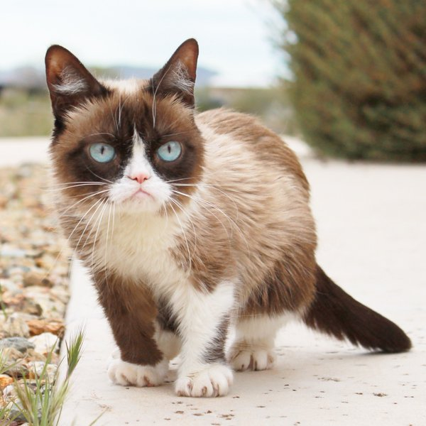
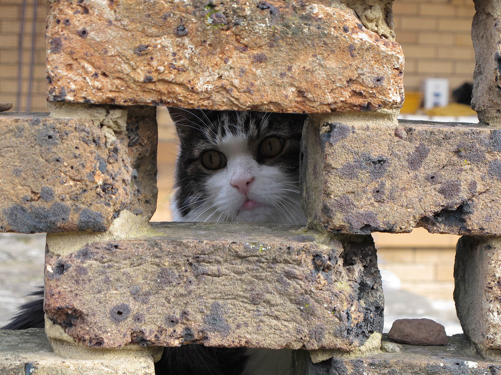

## fonts
{: .styleguide-heading}

### Sueca HD
{: .font-tertiary}

Sueca HD is an open-source serif typeface designed to be pleasant to read on screens. Sueca HD communicates credibility and is ideal for text-dense design: the letterforms have a tall x-height but remain relatively small, making for excellent readability across screen sizes while not occupying extra horizontal space, which is perfect for our Mastheads comprehensive amount of content. This font should not be used on numbers.
{: .font-tertiary}

{: .f-right .img-small}

{: .f-right .img-small}

{: .f-right .img-small}

Sueca HD is an open-source serif typeface designed to be pleasant to read on screens. Sueca HD communicates credibility and is ideal for text-dense design: the letterforms have a tall x-height but remain relatively small, making for excellent readability across screen sizes while not occupying extra horizontal space, which is perfect for our Mastheads comprehensive amount of content.
